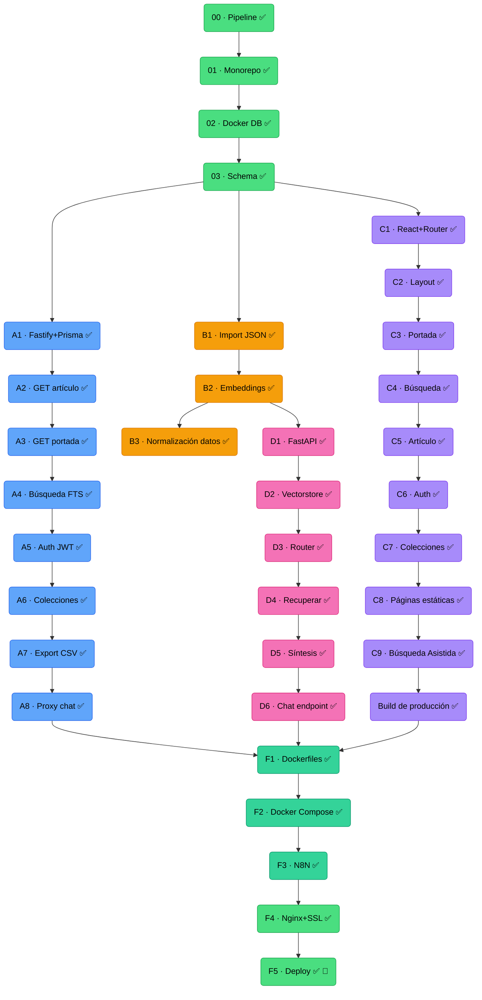

# Sansofé. Repositorio de Prensa de Canarias

Web App para la consulta e investigación de prensa histórica canaria, con búsqueda de texto completo y asistente de investigación basado en RAG (*Retrieval-Augmented Generation*). El proyecto es un MVP de demostración de servicio.

Proyecto final del bootcamp **Desarrollo Web Full Stack + IA** de Ironhack, en el marco de un proyecto de la Fundación Universitaria de Las Palmas financiado por el Cabildo Insular de Gran Canaria (junio 2026). Construido con **Node.js + Fastify + Prisma**, **React 18 + Vite**, **Python + FastAPI**, **PostgreSQL + pgvector**, **Docker Compose**, **N8N** y un agente **LangGraph** con búsqueda semántica sobre el corpus histórico vía **Vertex AI (Gemini + Embeddings)**.

[Web online](https://sansofe.kripta.dev/)

---

## Motivación

Los archivos históricos de prensa están digitalizados con OCR pero son difíciles de consultar: búsquedas básicas, sin contexto, sin cruce de fuentes, con textos truncados y palabras mal reconocidas. Este proyecto aborda ese problema aplicando Inteligencia Artificial tanto en la extracción del corpus como en la recuperación semántica de información, facilitando el acceso a investigadores en humanidades y periodismo con consultas como *"¿qué se decía en 1926 sobre la huelga de portuarios?"* o *"Dame todos los artículos donde se nombre a Pérez Galdós"*.

El MVP incluye publicaciones canarias de 1926 de dos periódicos, La Provincia y Gaceta de Tenerife — año elegido por corresponder al centenario. El proyecto está diseñado para ampliarse con nuevas publicaciones y períodos históricos.

---

## Funcionalidades

### Portal público
- **Portada histórica**: artículos publicados exactamente hace 100 años, generados una vez al día con N8N como contenido estático. Selector de fecha para navegar entre los últimos días disponibles.
- **Búsqueda full-text**: titulares y cuerpos de artículos, con filtros por publicación, sección, género periodístico y rango de fechas.
- **Exploración por sección**: artículos de una categoría temática con scroll infinito.
- **Detalle de artículo**: cuerpo completo con metadatos, publicación de origen y artículos relacionados de la misma sección.
- **Páginas informativas**: sobre el proyecto, metodología, fuentes, aviso legal, privacidad, accesibilidad y contacto (`/info/:slug`).

### Asistente de investigación (requiere registro)
Responde consultas en lenguaje natural sobre el corpus histórico:
- **Búsqueda por relevancia**: devuelve una lista de artículos relevantes con enlace directo.
- **Síntesis con fuentes**: genera un resumen a partir de los artículos más relevantes, citando cada fuente.
- **Síntesis de selección**: permite marcar artículos concretos del chat y sintetizarlos directamente, sin pasar por el agente LangGraph.

### Área privada
- Registro y autenticación con JWT. Login con email o nombre de persona usuaria.
- Colecciones: guardar artículos en carpetas temáticas y exportar a CSV.
- Investigaciones: guardar y recuperar conversaciones completas del asistente de IA.
- Perfil: editar datos personales y gestionar la clave de API de Gemini.

---

## Stack técnico

| Capa | Tecnología | Justificación |
|---|---|---|
| Frontend | React 18 + Vite + CSS Modules | SPA con tema vintage/moderno. Responsive: móvil (<600px), tablet (600–1023px), PC (≥1024px) |
| Backend CRUD | Node.js + Fastify + Prisma | Artículos, búsqueda, auth, colecciones |
| Microservicio IA | Python + FastAPI + LangGraph | Agente RAG con enrutamiento condicional |
| Base de datos | PostgreSQL 18.4 + pgvector | FTS nativo en español + búsqueda vectorial en una sola instancia |
| Embeddings | Vertex AI (`text-multilingual-embedding-002`) | 768 dimensiones, optimizado para español |
| LLM | Gemini 2.5 Flash (Google AI Studio) | Síntesis RAG (API key aportada por el usuario) y extracción del corpus |
| Automatización | N8N | Generación diaria de la portada histórica |
| Despliegue | Docker Compose + Nginx + kripta.dev | Servidor propio, sin dependencias de pago adicionales |

---

## Arquitectura

```
Usuario
    │
    ▼
┌─────────────────────────────────────────────┐
│           FRONTEND (React + Vite)           │
│  Portada │ Búsqueda │ Chat │ Área privada   │
└──────────────────────┬──────────────────────┘
                       │ HTTP/JSON
                       ▼
          ┌────────────────────────┐
          │  BACKEND               │
          │  Node.js + Fastify     │
          │                        │
          │  GET  /articulos       │
          │  GET  /portada         │
          │  POST /auth            │
          │  GET  /colecciones     │
          │  POST /chat ───────────┼──→ MICROSERVICIO IA
          └──────────┬─────────────┘     Python + FastAPI
                     │                   LangGraph agent
                     ▼                   (red interna Docker)
     ┌──────────────────────────┐
     │  PostgreSQL + pgvector   │
     │  articulos (FTS + vector)│
     │  usuarios │ colecciones  │
     └──────────────────────────┘
```

El agente LangGraph clasifica la consulta antes de responder:

```
consulta → Router ┬→ retrieve_only     → lista de artículos relevantes
                  └→ retrieve_and_synth → síntesis con fuentes citadas
```

---

## Corpus

| Publicación | Año | Ejemplares | Artículos |
|---|---|---|---|
| La Provincia | 1926 | 295 | ~19.000 |
| Gaceta de Tenerife | 1926 | 310 | ~19.800 |
| **Total** | | **605** | **~38.800** |

Los artículos se extraen de PDF mediante Gemini 2.5 Flash y se almacenan con su embedding vectorial para búsqueda semántica. El coste total del procesamiento (extracción + enriquecimiento de metadatos + generación de embeddings) fue de ~130 €. El pipeline completo está en `pipeline/`.

---

## Estructura del repositorio

```
sansofe-webapp/
├── apps/
│   ├── api/          # Node.js + Fastify + Prisma (backend CRUD/auth)
│   ├── web/          # React 18 + Vite + CSS Modules (frontend)
│   └── ai/           # Python + FastAPI + LangGraph (microservicio IA)
├── db/
│   └── migrations/   # Migraciones SQL
├── pipeline/         # Scripts de extracción e importación del corpus
├── n8n-workflows/    # Workflows N8N exportados como JSON
├── docs/
│   ├── Postman/      # Colección Postman y guía de uso
│   ├── info/         # Contenido de las páginas informativas (raw.githubusercontent.com)
│   └── uso-ia.md     # Informe de uso de IA
├── docker-compose.yml
├── .env.example
└── README.md
```

---

## Puesta en marcha

### Requisitos

- Docker y Docker Compose
- Node.js 20+ y pnpm
- Python 3.11+
- Cuenta de Google Cloud con Vertex AI habilitado (solo para regenerar el corpus; no necesario para ejecutar la app)

### Instalación

```bash
git clone https://github.com/Daniel-kripta/Proyecto_Final_Full_Stack_-_Sansofe_WebApp
cd Proyecto_Final_Full_Stack_-_Sansofe_WebApp
cp .env.example .env
# Rellenar variables en .env
```

### Levantar el entorno

```bash
# Base de datos
docker compose up -d db

# Backend
cd apps/api && pnpm install && pnpm dev

# Frontend
cd apps/web && pnpm install && pnpm dev

# Microservicio IA
cd apps/ai && python -m venv .venv && source .venv/bin/activate
pip install -r requirements.txt
uvicorn main:app --reload --port 8001
```

### Servicios Docker

El `docker-compose.yml` define tres servicios:

| Servicio | Imagen / Build | Puerto (host) | Descripción |
|---|---|---|---|
| `db` | `pgvector/pgvector:pg18` | `127.0.0.1:5433` | PostgreSQL 18 con extensión pgvector |
| `api` | `apps/api/Dockerfile` | `127.0.0.1:3002` | Backend Fastify. Arranca solo cuando `db` está healthy |
| `ai` | `apps/ai/Dockerfile` | interno (`ai:8001`) | Microservicio IA. Solo accesible desde la red interna Docker |

Todos los puertos están vinculados a `127.0.0.1` — no expuestos a Internet directamente. Nginx actúa como reverse proxy externo.

Las credenciales de Google Cloud se montan como volumen de solo lectura en el contenedor `ai`:

```env
GCLOUD_CREDENTIALS=/ruta/local/al/json/de/cuenta-de-servicio.json
```

---

## Despliegue

El proyecto se despliega en servidor propio (Hetzner CX23, `kripta.dev`) con Docker Compose y Nginx como reverse proxy. No hay dependencia de servicios externos de pago salvo Google Cloud (Vertex AI).

Durante el desarrollo se usó **Tailscale** para acceder de forma segura al servidor desde distintas redes, sin exponer puertos adicionales.

---

## Metodología de trabajo

El proyecto se desarrolla en 15 días (3–15 junio 2026) dividido en fases. Las cuatro primeras son secuenciales. A partir de la fase 03 se abren cuatro tracks que avanzan en paralelo y convergen en el bloque de despliegue final.



| Color | Track | Descripción |
|---|---|---|
| 🟦 Azul | Backend (A) | API REST con Fastify, Prisma y autenticación JWT |
| 🟡 Amarillo | Datos (B) | Importación del corpus y generación de embeddings |
| 🟣 Morado | Frontend (C) | Interfaz React con React Router y CSS Modules |
| 🩷 Rosa | IA (D) | Microservicio FastAPI con agente LangGraph y RAG |
| 🟩 Verde | Despliegue (F) | Docker Compose, Nginx, N8N y despliegue en kripta.dev |

---

## Tests

El proyecto incluye tests automatizados en los tres servicios.

### Backend (Node.js + Fastify)

```bash
cd apps/api && pnpm test
```

35 tests con [Vitest](https://vitest.dev/). Cubren las rutas de autenticación, artículos, colecciones e investigaciones mediante mocks de Prisma — sin base de datos real.

### Frontend (React + Vite)

```bash
cd apps/web && pnpm test           # tests
cd apps/web && pnpm test:coverage  # con informe de cobertura
```

70 tests con Vitest + Testing Library. Cubren los módulos de API (fetch mockeado), los formularios de autenticación y los componentes principales del chat y la navegación.

### Microservicio IA (Python + FastAPI)

```bash
# Requiere el contenedor en marcha
docker compose exec ai pytest tests/ -v
```

Tests con pytest. Cubren la validación de consultas (`security.py`), los modelos Pydantic, el endpoint `/health` y el endpoint `/chat` con el agente LangGraph mockeado.

---

## Documentación adicional

- [Backend API](apps/api/README.md) — endpoints, variables de entorno y arranque local
- [Frontend](apps/web/README.md) — páginas, estructura y arranque local
- [Microservicio IA](apps/ai/README.md) — agente RAG, endpoints y arquitectura
- [Pipeline](pipeline/README.md) — scripts de enriquecimiento, importación y embeddings
- [Colección Postman](docs/Postman/README.md)
- [Informe de uso de IA](docs/uso-ia.md)
- [Workflows N8N](n8n-workflows/)

---

## Licencias

**Contenido histórico** (artículos de prensa, 1926): dominio público — [Public Domain Mark 1.0](https://creativecommons.org/publicdomain/mark/1.0/).

**Plataforma** (código, diseño y base de datos): [CC BY-NC-SA 4.0 EU](https://creativecommons.org/licenses/by-nc-sa/4.0/) — libre para uso no comercial con atribución; los derivados heredan esta licencia.

**Fuentes documentales**: [Jable](https://jable.ulpgc.es/) (mdC - ULPGC) y [Maresía](https://www.ull.es/servicios/biblioteca/servicios/maresia/) (ULL).

---

## Autor

Daniel Kripta (Daniel García Zamora) — Proyecto final del bootcamp Desarrollo Web Full Stack + IA de Ironhack, en el marco de un proyecto de la Fundación Universitaria de Las Palmas financiado por el Cabildo Insular de Gran Canaria. Junio 2026.

---

## Agradecimientos

A **Jarko Garrido**, tutor del bootcamp, por su predisposición a enseñar y su metodología respetuosa con los distintos niveles de conocimiento previo y las diversas capacidades de aprendizaje.

A la **Fundación Universitaria de Las Palmas**, por esta oportunidad y en especial a quienes confiaron en mi perfil para entrar.

Al **Cabildo Insular de Gran Canaria**, por hacer posible la financiación del proyecto del bootcamp, asumiendo una vez más el papel de las instituciones públicas como redistribuidoras de oportunidades. Espero poder devolver de alguna forma, algún día, esta inversión a la sociedad grancanaria.
