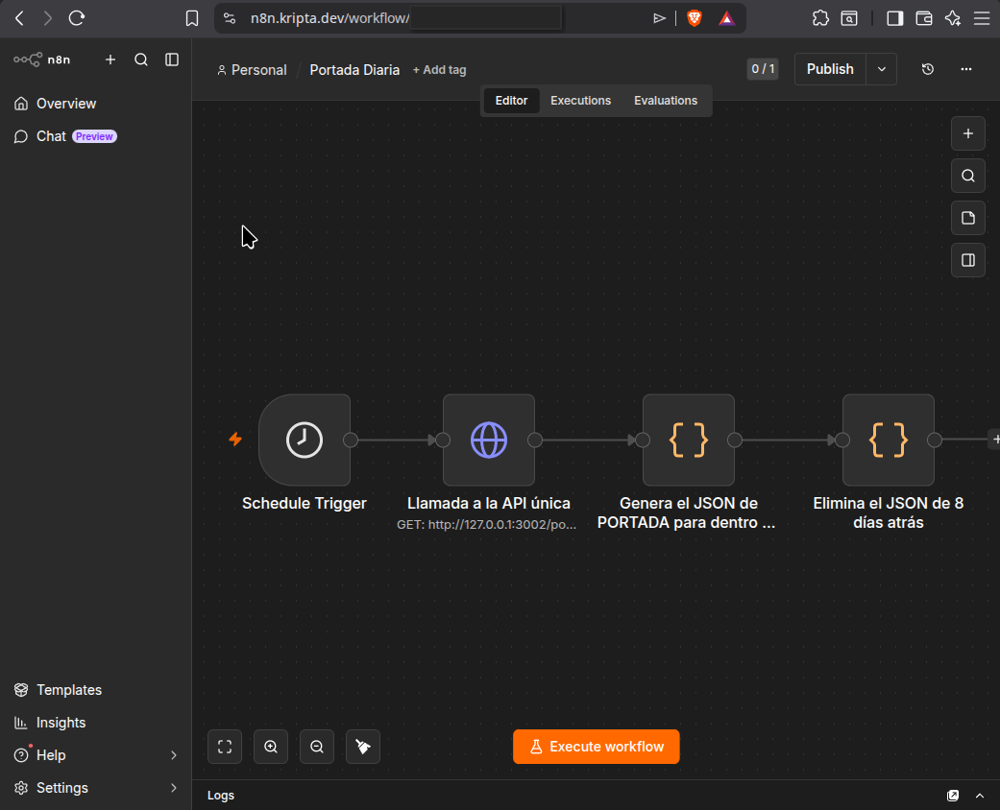

# N8N Workflows

Workflows de N8N exportados como JSON. N8N está instalado en kripta.dev y gestiona la automatización de la portada diaria.

---

## [workflow-Portada_n8n.json](workflow-Portada_n8n.json)

Genera cada noche el fichero JSON estático que el frontend usa como portada.

**Activo en producción.**

### Qué hace

Cada noche a las 00:05 consulta la API para obtener los artículos del día equivalente hace 100 años, los agrupa por sección temática y escribe un fichero JSON estático que Nginx sirve directamente. El frontend nunca consulta la base de datos para la portada.



### Nodos

**1. Schedule Trigger**
- Cron: `5 0 * * *` (00:05 cada día)

**2. HTTP Request**
- Método: GET
- URL: `http://127.0.0.1:3002/portada?fecha={{ $now.minus({years: 100}).toFormat('yyyy-MM-dd') }}`
- Llama a la API Fastify directamente (sin pasar por Nginx)

**3. Code (JavaScript)**

Agrupa los artículos por sección y escribe el fichero:

```javascript
const fs = require('fs');

const date = new Date();
date.setFullYear(date.getFullYear() - 100);
const filename = date.toISOString().split('T')[0];

const articulos = $input.all()[0].json;

const SECCIONES = [
  'anuncios', 'sucesos', 'sociedad', 'política', 'internacional',
  'economía', 'cultura', 'deportes', 'religión', 'agricultura', 'militar', 'otros'
];

const grouped = {};
for (const art of articulos) {
  const topics = art.topics || [];
  const seccion = topics.find(t => SECCIONES.includes(t)) || 'otros';
  if (!grouped[seccion]) grouped[seccion] = [];
  grouped[seccion].push(art);
}

const dir = '/home/kripta/apps/sansofe/static/portada';
fs.mkdirSync(dir, { recursive: true });
fs.writeFileSync(`${dir}/${filename}.json`, JSON.stringify(grouped));

return $input.all();
```

### Fichero generado

```
/home/kripta/apps/sansofe/static/portada/YYYY-MM-DD.json
```

Nginx sirve este directorio bajo la ruta `/static/portada/`. El frontend hace fetch de `/static/portada/YYYY-MM-DD.json` con fallback a los 3 días anteriores (por si no hay periódico ese día).

### Requisito de configuración

El proceso N8N necesita la variable de entorno:

```
NODE_FUNCTION_ALLOW_BUILTIN=fs
```

Sin ella, el módulo `fs` no está disponible en los nodos Code.
